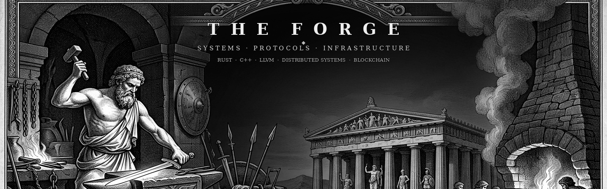
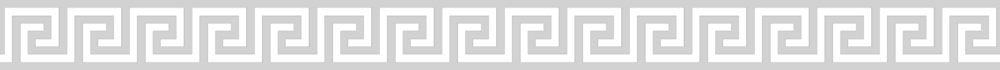
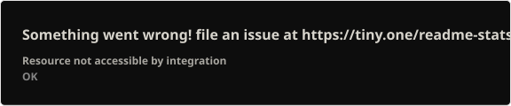
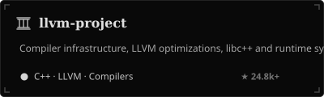
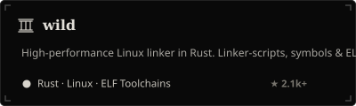
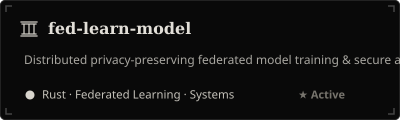
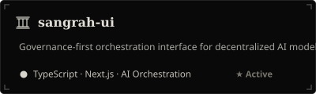

<p align="center">
  
</p>

<p align="center">
  
</p>

<h1 align="center">ARTH SRIVASTAVA</h1>

<p align="center">
  <b>Building systems, protocols & products.</b>
</p>

<p align="center">
  Rust · C++ · LLVM · Linkers · Federated AI · Blockchain
</p>

<p align="center">
  <a href="https://github.com/Blazearth">
    
  </a>
  <a href="https://www.linkedin.com/in/arth-srivastava30/">
    
  </a>
  <a href="mailto:arthsrivastava1@gmail.com">
    
  </a>
</p>

---

## ⚒ THE FORGE

Building at the layers where software stops being abstract—from compiler backends and linkers to federated AI and decentralized protocols.

> *The interesting bugs usually live three abstractions below where you first started looking.*

---

## ⚔ THE DOMAINS

<table>
  <tr>
    <td width="33%" valign="top">

### ⚙ SYSTEMS
Rust · C++  
LLVM · Linkers  
Linux Toolchains  

</td>
<td width="33%" valign="top">

### 🧠 FEDERATED AI
Privacy-Preserving ML  
Local Model Training  
Secure Aggregation  

</td>
<td width="33%" valign="top">

### ⛓ PROTOCOLS
Solana · Anchor  
Solidity · Foundry  
Smart Contracts  

</td>
</tr>
</table>

---

## 🏛 THE WORKS

### `llvm-project`
Contributing to LLVM compiler infrastructure, optimizations, and runtime libraries.  
**Focus:** C++ · LLVM · Compilers · Optimization

---

### `wild`
High-performance Linux linker written in Rust. Contributing to linker scripts, symbol resolution, and debugging infrastructure.  
**Focus:** Rust · ELF · Linkers · Toolchains

---

### `fed-learn-model`
Core infrastructure for distributed, privacy-preserving federated model training in Rust.  
**Focus:** Rust · Federated Learning · Privacy · Systems

---

### `sangrah-ui`
Governance-first interface and orchestration layer for federated AI training networks.  
**Focus:** TypeScript · Next.js · AI Orchestration

---

### `Blockchain & Protocols`
Smart contracts and decentralized applications spanning Solana (`defi_insta`) and EVM (`Foundry Fund Me`).  
**Focus:** Rust · Anchor · Solana · Solidity · Foundry

---

## 🛠 TOOLKIT

```text
Rust         ████████████████
C++          ███████████████
TypeScript   █████████████
Solidity     ████████████
Python       █████████
```

`LLVM` · `Linux` · `Docker` · `Solana` · `Foundry` · `Federated Learning` · `PostgreSQL` · `Git`

---

## 📊 THE ARCHIVE

<p align="center">
  
  
</p>

<p align="center">
  
</p>

---

## 🐍 CONTRIBUTION TRAIL

<p align="center">
  <picture>
    <source media="(prefers-color-scheme: dark)" srcset="https://raw.githubusercontent.com/Blazearth/Blazearth/output/github-snake-dark.svg" />
    <source media="(prefers-color-scheme: light)" srcset="https://raw.githubusercontent.com/Blazearth/Blazearth/output/github-snake.svg" />
    
  </picture>
</p>

---

## 🏺 SELECTED REPOSITORIES

<p align="center">
  <a href="https://github.com/Blazearth/llvm-project">
    
  </a>
  <a href="https://github.com/Blazearth/wild">
    
  </a>
</p>
<p align="center">
  <a href="https://github.com/Blazearth/fed-learn-model">
    
  </a>
  <a href="https://github.com/Blazearth/sangrah-ui">
    
  </a>
</p>

---

<p align="center">
  
</p>

<p align="center">
  <i>Build carefully. Break interesting things.</i>
</p>

<p align="center">
  <sub>Blazearth · Arth Srivastava</sub>
</p>
